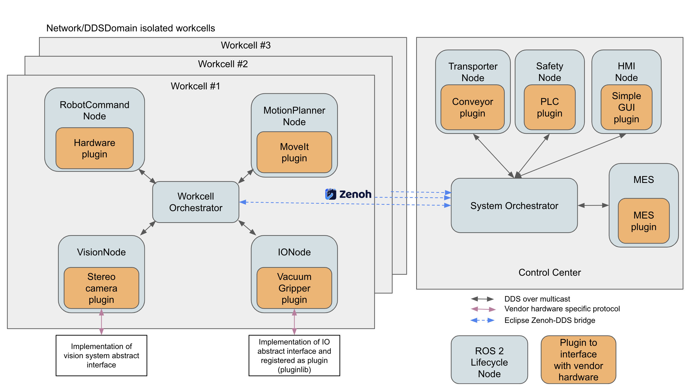
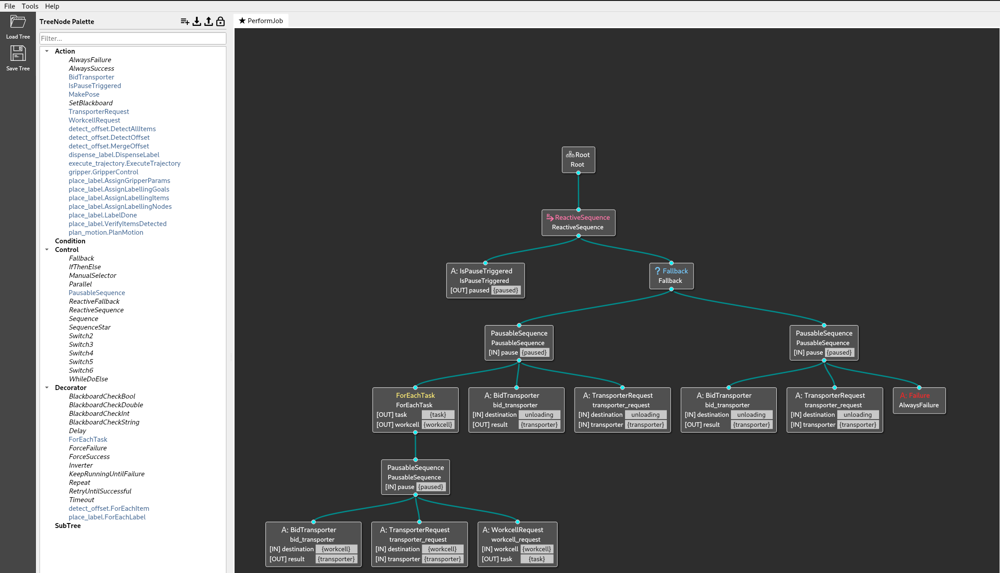
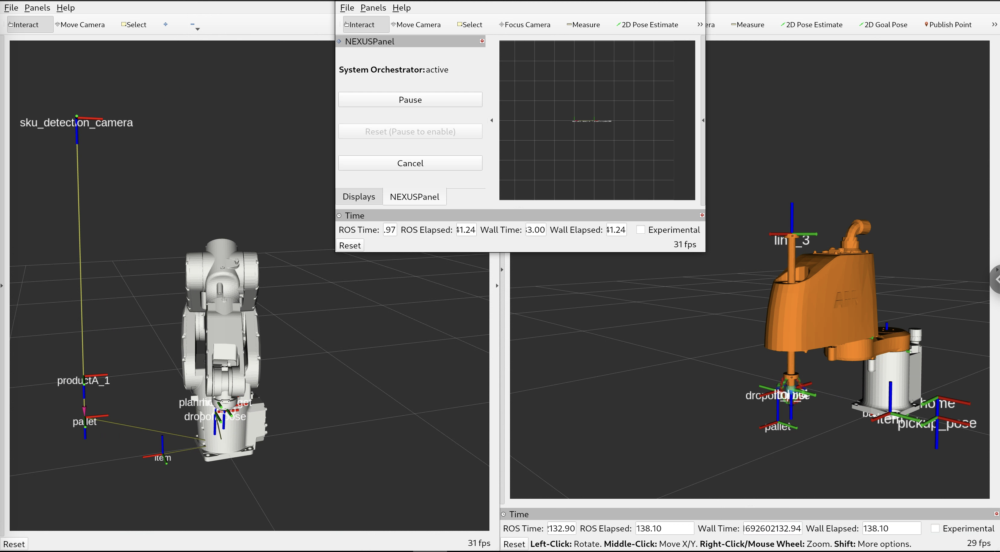

# NEXUS
[](https://github.com/osrf/nexus/actions/workflows/style.yaml)
[](https://github.com/osrf/nexus/actions/workflows/nexus_integration_tests.yaml)
[](https://github.com/osrf/nexus/actions/workflows/nexus_workcell_editor.yaml)



A ROS 2 framework which enables configuration and orchestration of process workflows for both individual robotic cells and sets of cells (line). NEXUS facilitates the integration of hardware agnostic industrial robotics and traditional automation components, specifying each cell or line processes through re-configurable behaviour trees. Cells in a line, or hardware components in a cell, can be triggered concurrently or sequentially according to recipes, managed through the orchestrator, departing from traditional Programmable Logic Controllers.

For details on architecture and concepts [see](./docs/concepts.md).

## Requirements
* [ROS 2 Jazzy](https://docs.ros.org/en/jazzy/Installation/Ubuntu-Install-Debians.html) on `Ubuntu 24.04`

## Setup

### Install system dependencies
While `cargo` and `rustc` can be installed via rosdep, the version that available is
v1.66 on most target platforms. However most dependencies require newer versions of `cargo` and `rustc`.
Hence for now, we will install the latest version manually.
TODO: Consider adding this dep back for J turtle if Ubuntu 24.04 has the newer.
cargo and rustc pkgs.

```bash
sudo apt update && sudo apt install curl
curl --proto '=https' --tlsv1.2 -sSf https://sh.rustup.rs | sh
```

### Setup the NEXUS workspace

```bash
mkdir ~/ws_nexus/src -p
cd ~/ws_nexus/src/
git clone git@github.com:osrf/nexus
vcs import . < nexus/abb.repos
vcs import . < nexus/rmf.repos
cd ~/ws_nexus
rosdep install --from-paths src --ignore-src --rosdistro jazzy -y -r
```

### Build the NEXUS workspace
```bash
source /opt/ros/jazzy/setup.bash
colcon build --cmake-args -DCMAKE_BUILD_TYPE=Release
```

## Configuration

The workcell and system orchestrators rely on behavior trees for orchestration. `NEXUS` provides several BT skills that may be reused for a variety of applications.
See sample BTs for [system_orchestrator](nexus_integration_tests/config/system_orchestrator_bt.xml) and [workcell_orchestrator](nexus_integration_tests/config/workcell_1_bts/place_on_conveyor.xml) for a pick & place application.

At present, capabilities are registered as plugins with the `orchestrator` at runtime.
We support [these capabilities](./nexus_capabilities/src/capabilities/plugins.xml) out of the bo
Each plugin may register one or more behavior tree nodes which can then be used to define processes as seen in the `place_on_conveyor.xml`.
The framework to register capabilities and map them to processes that can be performed in ongoing work. See [this discussion](https://github.com/osrf/nexus/discussions/32) for more details.

### Visualization [experimental]


At present, behavior trees can be viewed and modified using [Groot](https://github.com/BehaviorTree/Groot). Once `Groot` is launched, click "Load palette from file" and select [nexus_tree_nodes.xml](./nexus_tree_nodes.xml). Then any of the configured BTs can be loaded via the "Load Tree" button.
A current limitation of this approach is the need to manually update the palette file when the plugins loaded by a task capability changes. In the future, the goals is to more closely couple the generation of this file and the skill plugins the orchestrators are capable of loading.

### Generating Zenoh bridge configurations

The script in `nexus_network_configuration` helps to simplify configuration of Zenoh bridges for multiple machines. The Zenoh bridge files are generated from [NEXUS Network Configuration](nexus_integration_tests/config/zenoh/nexus_network_config.yaml) and [nexus_endpoints.redf.yaml](./nexus_endpoints.redf.yaml). After configuring the [NEXUS Network Configuration](nexus_integration_tests/config/zenoh/nexus_network_config.yaml), you can run `ros2 run nexus_network_configuration nexus_network_configuration -n <PATH_TO_NEXUS_NETWORK_CONFIG> -r <PATH_TO_REDF_CONFIGS> -o <ZENOH_CONFIGS_OUTPUT_DIRECTORY>` to generate the Zenoh bridges.

Further detailed instructions on running the Zenoh bridges with said configurations are in the [package README](nexus_network_configuration/README.md)

## Demos



Follow instructions [here](nexus_integration_tests/README.md) to run pick and place demonstrations with a line comprising of two workcells that perform different types of tasks.

TODO: Add a dedicated demo package.


## Generating Endpoints

The `nexus_endpoints` package contains ROS topics, services and actions used by NEXUS. The package is generated from [nexus_endpoints.redf.yaml](./nexus_endpoints.redf.yaml) using `redf`. rust is required to generated the package, the easiest way to install rust is via [rustup](https://rustup.rs/).

With rust installed, clone the redf repo at https://github.com/osrf/redf, then run
```bash
cargo install --path .
```

With redf installed, run `generate_endpoints.sh` to generate the package.

## Contributing
All contributions are welcome! Please ensure the following guidelines are followed when submitting pull requests:

### Signed commits
* Ensure all commits are [signed](https://docs.github.com/en/authentication/managing-commit-signature-verification/signing-commits).

### Endpoints
Ensure your code does not directly import interface definitions or use hardcoded strings for ROS 2 endpoints.
All endpoint properties must be retrieved from [nexus_endpoints.hpp](nexus_endpoints/nexus_endpoints.hpp).
If an endpoint is missing, first add its definition to [nexus_endpoints.redf.yaml](./nexus_endpoints.redf.yaml) and then follow the instructions [above](#generating-endpoints) to re-generate `nexus_endpoints.hpp`.

### Code style
#### C++
The NEXUS codebase adheres to C++ style format as used in the [Open-RMF](https://github.com/open-rmf/rmf) project.
The linter of choice is `uncrustify` and the configuration used may be referenced [here](https://github.com/open-rmf/rmf_utils/blob/main/rmf_utils/test/format/rmf_code_style.cfg).
Instead of invoking `uncrustify` directly, use `ament_uncrustify` instead which is a wrapper around a specific version of `uncrustify`.
You may locally run the linter as follows
```bash
sudo apt update && sudo apt install -y ros-jazzy-rmf-utils # This is a one-time step
source /opt/ros/jazzy/setup.bash
cd ~/ws_nexus/src/nexus
ament_uncrustify -c /opt/ros/jazzy/share/rmf_utils/rmf_code_style.cfg . --language C++ --exclude nexus_endpoints/nexus_endpoints.hpp
```
To automatically reformat the code, append `--reformat` to the `ament_uncrustify` line above.
It is highly recommended to audit the changes by the linter before committing.

#### Python
The NEXUS codebase adheres to [PEP8](https://peps.python.org/pep-0008/) style format for python scripts.
A linter such as `pycodestyle` may be used for linting.
