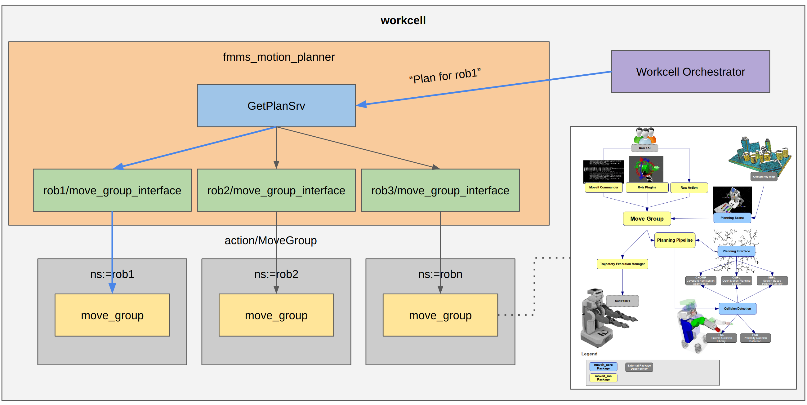

# nexus_motion_planner


This package implements the Motion Planner Server as a lifecycle node managed by the workcell orchestrator.

The Motion Planner Server implements a standardized ROS2 Interface [nexus_motion_planner_msgs::GetMotionPlan](nexus_msgs/nexus_motion_planner_msgs/srv/GetMotionPlan.srv) to receive motion planning requests from the Workcell Orchestrator.

This motion plan in the form of a [trajectory_msgs/JointTrajectory](https://docs.ros2.org/foxy/api/trajectory_msgs/msg/JointTrajectory.html) will be forwarded by the Workcell Orchestrator to the Controller Server for execution via another action, the trajectory execution works independently of Motion Planner Server.

The Motion Planner Server is meant to be:
- Hardware-agnostic
  - New robots can be configured and set up easily with the help of moveit setup assistant.
- Planner-agnostic
  - Plugin-based.
  - Planners can be easily added via implementation of `moveit_core::planning_interface`
- Database Vendor-agnostic
  - Plugin-based.
  - Alternative databases can be easily integrated via implementation of `warehouse_ros::DatabaseLoader`
  - Currently available databases are `SQLite3` and `MongoDB`

What Motion Planner Server does not do:
- Execute robot trajectories. This is done by the Controller Server which uses the [JointTrajectoryController](https://github.com/ros-controls/ros2_controllers/blob/master/joint_trajectory_controller/src/joint_trajectory_controller.cpp) to execute [trajectory_msgs/JointTrajectory](https://docs.ros2.org/foxy/api/trajectory_msgs/msg/JointTrajectory.html) plans from Motion Planner Server.

The `nexus_motion_planner::motion_planner_server` is currently a wrapper around [MoveGroupInterface](https://github.com/ros-planning/moveit2/tree/main/moveit_ros/planning_interface/move_group_interface) which simplifies querying and configuring [move_group](https://moveit.ros.org/documentation/concepts/). The `motion_planner_server` can be configured to setup interfaces with multiple `move_groups` and thus becomes a manager of `move_group_interfaces`. When a motion plan request from the `workcell orchestrator` is received for one of the configured robots, it simply queries the `move_group` of that robot via its `move_group_interface`.

The `use_move_group_interfaces` parameter is set `True` by default which enables the above behavior.
For future work, the `motion_planner_server` may directly initialize [PlanningPipelines](https://github.com/ros-planning/moveit2/blob/5c3f98ee4733829154e5de395f9d6eee0b7fd2d9/moveit_ros/planning/planning_pipeline/include/moveit/planning_pipeline/planning_pipeline.h#L83) for each robot thereby skipping the need to interface with `move_group`.

# Quick start

## 1. Set up configuration parameters
Motion Planner Server allows you to request plans for each individual robot. These robots can be configured to have a default `planning_group`, their own specific `planner_plugin` params and `kinematic_plugin solver` params.
Explanation of each configuration parameter are commented in [planner_params.yaml](config/planner_params.yaml)


## 2. Launch the motion planner server

A demo script that launches `move_group` along with the `motion_planner_server` is included.
By default the `abb_irb1300` robot is used.
```bash
ros2 launch nexus_motion_planner demo_planner_server.launch.py
```

To try a different robot, launch with some parameter substitutions.
```bash
ros2 launch nexus_motion_planner demo_planner_server.launch.py support_package:=abb_irb910sc_support robot_xacro_file:=irb910sc_3_45.xacro moveit_config_package:=abb_irb910sc_3_45_moveit_config moveit_config_file:=abb_irb910sc_3_45.srdf.xacro
```

## 3. Configuring and activating up the Motion Planner Server lifecycle node

Configuring should start up the service servers, services and any suscribers.

Activation should start up the moveit components (i.e. Planning Pipeline, Planning Scene Monitor and Moveit Visualization Tools).

```bash
ros2 lifecycle set /motion_planner_server configure
ros2 lifecycle set /motion_planner_server activate
```

## 4. Start an example service client for sending motion planning tasks
Refer to [src/test_request.cpp](src/test_request.cpp) for an example on how to interact with the Motion Planner Server via the [nexus_motion_planner_msgs::GetMotionPlan](nexus_msgs/nexus_motion_planner_msgs/srv/GetMotionPlan.srv) service.
Below are some example poses/joint values given for manual testing.

### IRB910SC
```bash
# Specifying end-effector poses. Optionally, start value can be specified "-s <pose_string>"
# Home state (frame_id: item): 0.150,-0.200,0.051,1,0,0,0
# paste_item state (frame_id: item): 0.145,-0.166,-0.053,1.00,0.0,0.0,0.0
# pick_item state (frame_id: item): -0.384,0.193,0.046,1.00,0.0,0.0,0.0
ros2 run nexus_motion_planner test_request -name abb_irb910sc -frame_id item -goal_type 0 -t -0.384,0.193,0.046,1.00,0.0,0.0,0.0

# Specifying joint values. Optionally, start value can be specified "-sj <joint_values_string>"
# home state: 0,0,0,0
# paste_item state: 0,0,-0.1,0
# pick_item state: 1.2,1.2,-0.1,0.1
ros2 run nexus_motion_planner test_request -name abb_irb910sc -frame_id item -goal_type 1 -tj 1.2,1.2,-0.1,0.1
```

### IRB1300
```bash
# Specifying end-effector poses. Optionally, start value can be specified "-s <pose_string>"
# Home state: 0.654250,0.0,1.143500,0.0,0.707107,0.0,0.707107
# paste_item state: 0.794981,0.000000,0.063564,0.000000,0.707107,0.000000,0.707107
# pick_item state: 0.054310,0.765854,0.677203,-0.498732,0.592116,0.454073,0.441002
ros2 run nexus_motion_planner test_request -name abb_irb1300 -frame_id item -goal_type 0 -t 0.794981,0.000000,0.063564,0.000000,0.707107,0.000000,0.707107

# Specifying joint values. Optionally, start value can be specified "-sj <joint_values_string>"
# home state: 0,0,0,0,0,0
# paste_item state: 0,1.3,0,0,0,0
# pick_item state: 1.5,0.5,0.5,0,-0.8,0.1
ros2 run nexus_motion_planner test_request -name abb_irb1300 -frame_id item -goal_type 1 -tj 1.5,0.5,0.5,0,-0.8,0.1
```
> Note: For debugging purposes, you can also add a `-send_traj` flag which will publish a joint trajectory message on "/manipulator_controller/joint_trajectory".

> You can also define the frame_id of the start/goal pose with the `-frame_id` flag.

### Re-using cached motion plans
All paths will be saved to the database by default. First a string is obtained by appending the `planning_group`, start and goal values. This string is then hashed into a `plan_id` and saved under the `plan_id` into the collection that corresponds to the robot. Subsequent plans using the same `planning_group`, start and end point should be fetched from cache and not regenerated.

# Expected interactions between workcell orchestrator and motion planner server

## Services

1. "/motion_planner_server/plan" [nexus_motion_planner_msgs::srv::GetMotionPlan](nexus_msgs/nexus_motion_planner_msgs/srv/GetMotionPlan.srv): Service for requesting motion plan.
2. "~/change_state" [lifecycle_msgs::srv::ChangeState](https://docs.ros2.org/foxy/api/lifecycle_msgs/srv/ChangeState.html): Set lifecycle states
3. "~/get_state" [lifecycle_msgs::srv::GetState](https://docs.ros2.org/foxy/api/lifecycle_msgs/srv/GetState.html): Get lifecycle states

## Topics

1. "~/motion_plan_request" [moveit_msgs::msg::MotionPlanRequest](http://docs.ros.org/en/melodic/api/moveit_msgs/html/msg/MotionPlanRequest.html): Publish Motion Plan Request taken by Motion Planner Server, used for debugging purposes.

# Database Schema

Right now, the database plugin used is [warehouse_ros_sqlite](https://github.com/ros-planning/warehouse_ros_sqlite), this is because `mongoDB` is not supported on `Jammy` yet (as of 25/08/2022).
To avoid writing/reading to specific `SQLite` files, the `warehouse_host` is set to ":memory:" (i.e. In-memory).

This means that all cached motion plans will be lost upon restart of the node. During deployment, it should write to storage to survive restarts.

In the future, the move will be made to use [warehouse_ros_mongo](https://github.com/ros-planning/warehouse_ros_mongo) the non-relational database structure would be more intuitive for storing/organising motion plans.

Useful links:
  - [warehouse_ros_sqlite Schema](https://github.com/ros-planning/warehouse_ros_sqlite/blob/ros2/SCHEMA.md)

# Issues
- If you are experiencing SEGFAULT, make sure to have installed all the ROS Dependencies from the package.xml via `rosdep`

- Database
  - Currently no way of handling if motion plan database gets too large.

- Fetching of cached paths:
  - No collision checks are done when cached paths are used. This is done with the assumption that the planning scene is fixed.
